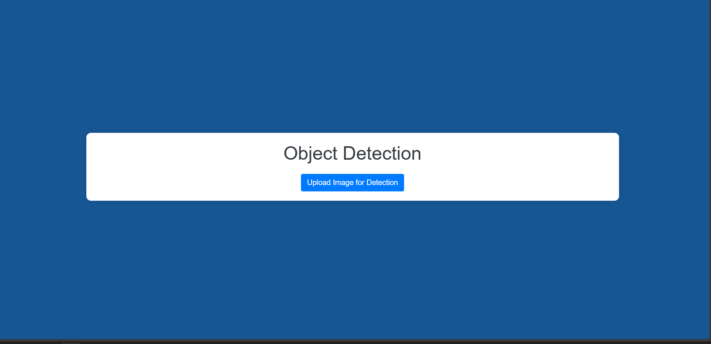
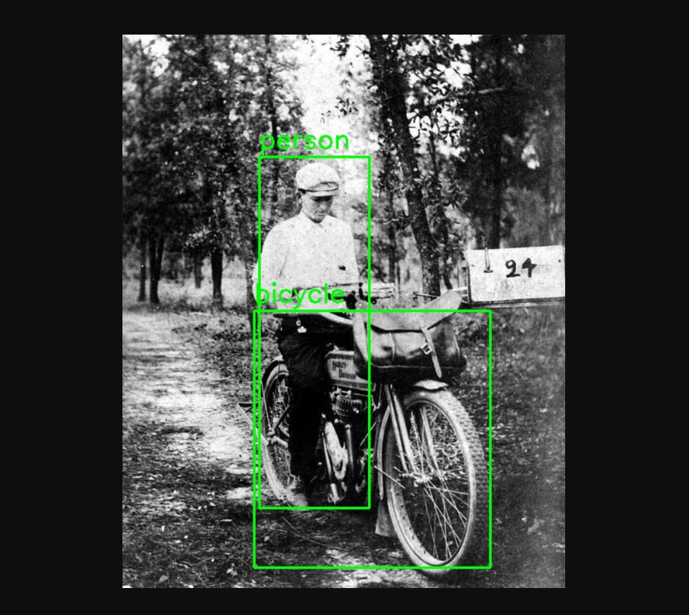

# Object Detection Web App

This repository contains a web-based object detection application utilizing a **pre-trained SSD MobileNet V2 FPNLite 320x320** model. The app allows users to upload images, detects objects within the images, and displays bounding boxes around detected objects.

## Features
- **Object Detection**: Detects multiple objects in an image using a pre-trained model.
- **Bounding Boxes**: Draws bounding boxes around the detected objects.
- **Web Interface**: Provides a user-friendly web page to upload images and visualize the results.

## Repo Structure

- **`ModelNotebook.ipynb`**: Jupyter Notebook demonstrating model usage for object detection and visualization using the SSD MobileNet V2 model.
- **`model.py`**: Python script responsible for loading the model and performing object detection.
- **`requirements.txt`**: List of required Python packages to run the application.
- **`templates/`**: Folder containing HTML templates (such as `upload.html`) for the web interface.
- **`uploads/`**: Directory to store uploaded images for detection.
- **`mscoco_complete_label_map.pbtxt`**: Label map for COCO dataset that maps object classes to their respective labels.
- **`ssd_mobilenet_v2_fpnlite_320x320_coco17_tpu-8/`**: Directory containing the pre-trained model files.

## How to Run the Application

### Prerequisites
- **Python 3.x**
- TensorFlow (version 2.10 or compatible with SSD MobileNet V2 FPNLite 320x320)
- Flask (if using Flask for web backend)
- Matplotlib (if using Jupyter Notebook)

### Steps

1. **Clone the Repository**:
   ```bash
   git clone https://github.com/blackstack-kun/Object-Detection-WebApp
   cd Object-Detection-WebApp
   ```

2. **Install Dependencies**:
   Install the required packages from the `requirements.txt` file:
   ```bash
   pip install -r requirements.txt
   ```

3. **Run the Application**:
   Execute the `model.py` script to start the application:
   ```bash
   python model.py
   ```

4. **Access the Web Interface**:
   Open your browser and go to `http://127.0.0.1:5000/`. You can now upload an image, and the app will detect objects and display the result with bounding boxes.

### File Upload and Detection Flow
1. **Upload an Image**: Use the web interface to upload an image.
2. **Object Detection**: The SSD MobileNet V2 model processes the uploaded image to detect objects.
3. **Display Results**: The detected objects are displayed on the image with bounding boxes, and a list of detected objects is provided.

## Model Details

- **Model**: SSD MobileNet V2 FPNLite 320x320
- **Dataset**: COCO 2017 (Common Objects in Context)
- **Architecture**: The SSD MobileNet V2 FPNLite architecture is a lightweight object detection model designed to perform well on resource-constrained devices while maintaining high detection accuracy.

## Example

1. **Input Image**: The user uploads an image through the web interface.
   
2. **Output**: The image is displayed with bounding boxes and object labels.
   

## Contributing
Feel free to submit issues or pull requests if you want to contribute to the project.

## License
This project is licensed under the MIT License.
